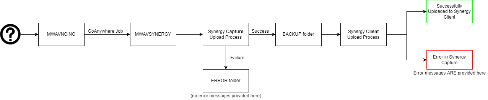

# nCino Synergy File Watcher
Nodejs utility for both automatically and manually monitoring the nCino Synergy document upload process.

## Startup Command
    node ./nodeProject

When run in the project directory, this starts the server on port 3000

## Classes
| File | Class Name | Description |
| ---- | ----------- | ----- |
| utilities.js | N/A | Utility functions and global variable(s) |
| outputbuilder.js | OutputBuilder | Utility functions for creating readable output relating to nCinoXML lists|
| ncinoxml.js | nCinoXML | Extrapolates FilingJobInfo object into a nCino-specific format (by bringing Indexes, other relevant information to the surface) |
| filingjobinfo.js | FilingJobInfo | Represents any standard Synergy-formatted XML document. Contains Batches |
| batchinfo.js | BatchInfo | Holds information from Batch tags within the standard Synergy-formatted XML document. Contains Documents |
| documentinfo.js | DocumentInfo | Holds information from Document tags within the standard Synergy-formatted XML object. Contains Indexes |
| indexinfo.js | IndexInfo | Represents an Index from a given Synergy-formatted XML document |
| serverctl.js | ServerCtl | Server Controller. Used to start and setup the webpage and backend endpoints |
| emailctl.js | EmailCtl | Email utility, sends emails from info@marinecu.com, using the SMTP server email.marinecu.com |
| timedfilequeuectl.js | TimedFileQueueCtl | File watching utility. See class file for more detailed description |

See individual files for more in-depth documentation, including method and attribute information

## Service Setup
In "Scripts" folder:
1. If service is already installed, run "node scripts/uninstallservice.js"
2. Edit scripts/installservice.js to update the desired service name and description, as well as setting the 'script' value on line 7 to point to nodeProject.js in the project directory
3. Run "node scripts/installservice.js"
4. On completion, open the Services windows on your desktop and ensure the service is running correctly

# Synergy Automation Overview

1. Documents are offloaded from the nCino Salesforce environment onto \\\\mwavncino\nCino\DES\images
2. GoAnywhere job "nCino Import Handler" picks up files from the above location, and copies them to \\\\mwavsynergy\synergy\nCino 
(runs hourly, at the top of every hour)
3. Synergy Capture polls this location every minute, and picks up any XMLs, and their matching PDFs, whenever it sees a new one. If an error occurs, the XML file gets put into the {SYNAUTOIMP}\ERROR directory, otherwise it gets put into the {SYNAUTOIMP}\BACKUP directory, which indicates it is successfully gets uploaded into Synergy Capture (our Synergy admin tool).
4. Synergy Capture then attempts to process the document and upload it to Synergy Client (where our lenders and auditors can view the documents). On success, the document will be marked with a "completed" status within the Synergy Capture program. On error, it will have another status (most commonly "File"). You can then click on the file to view any errors that may have occurred

Note: If a document in the Synergy Capture client isn't successfully uploaded, and it has a message of "Document Error: Storage Error", re-try uploading it by pressing the save button in the upper right corner, and this should fix the issue. This is a known issue with MDT, who are working to figure out the cause of it.